# Creating a Chart

## Overview
This tutorial will walk you through creating your first chart in Chartio. In just a few minutes,
you'll be visualizing the top 5 delinquent customers by plan amount based on Stripe invoice data
stored in dashDB! Before starting this tutorial, make sure you have completed the
[Getting Connected tutorial](../getting-connected/README.md). Don't hesitate to
[contact support](../support/README.md) if you run into any issues!

## Tutorial

### Steps
- [Create a new dashboard, name it, categorize it and click "Create Dashboard"](#create-a-new-dashboard-name-it-categorize-it-and-click-create-dashboard)
- [Navigate to the Chart Creator by adding a Chart element](#navigate-to-the-chart-creator-by-adding-a-chart-element)
- [Search for the `St Customer` table](#search-for-the-st-customer-table)
- [Drag `Email` into Diemnsions and `Delinquent` into Filters, filter on "equals 1"](#drag-email-into-diemnsions-and-delinquent-into-filters-filter-on-equals-1)
- [Drag `Plan Amount` from `St Customer Subscriptions` into Measures, sort descending](#drag-plan-amount-from-st-customer-subscriptions-into-measures-sort-descending)
- [Limit the result set to 5 and click "Refresh Chart"](#limit-the-result-set-to-5-and-click-refresh-chart)
- [Use the Data Pipeline to divide the `Plan Amount` in cents by 100 to get dollars](#use-the-data-pipeline-to-divide-the-plan-amount-in-cents-by-100-to-get-dollars)
- [Change the visualization from table to bar chart](#change-the-visualization-from-table-to-bar-chart)
- [Navigate to the Chart Settings, title the chart and y-axis and click "Done"](#navigate-to-the-chart-settings-title-the-chart-and-y-axis-and-click-done)
- [Save the chart to the dashboard](#save-the-chart-to-the-dashboard)

### Create a new dashboard, name it, categorize it and click "Create Dashboard"
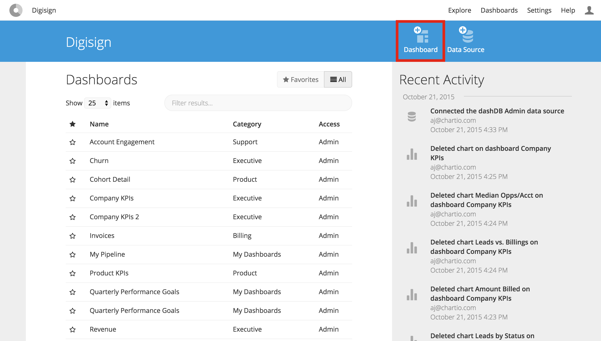
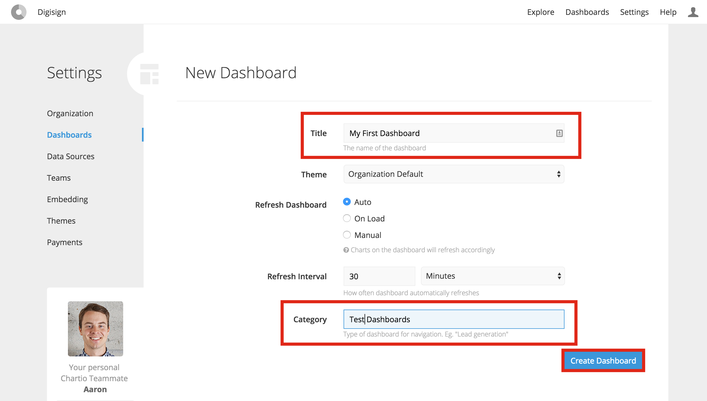

### Navigate to the Chart Creator by adding a Chart element
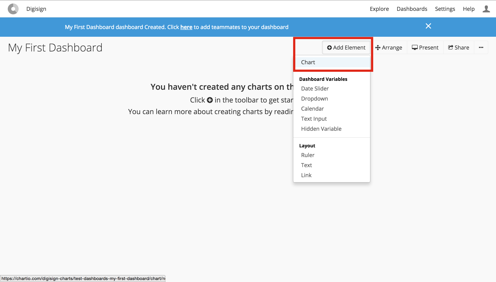
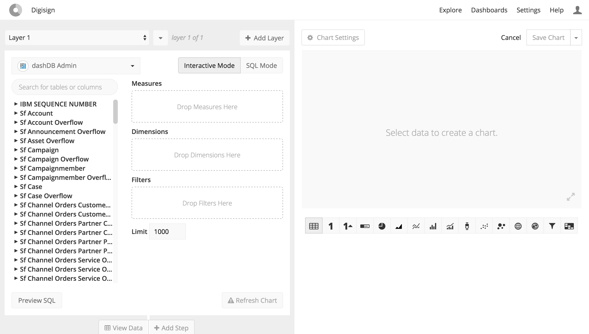

### Search for the `St Customer` table

### Drag `Email` into Diemnsions and `Delinquent` into Filters, filter on "equals 1"

### Drag `Plan Amount` from `St Customer Subscriptions` into Measures, sort descending
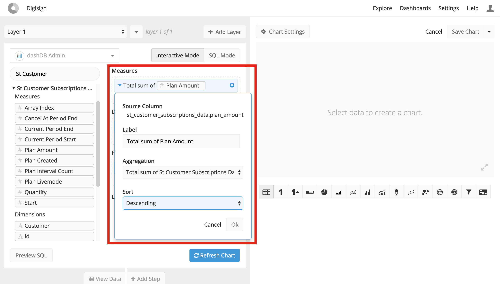

### Limit the result set to 5 and click "Refresh Chart"
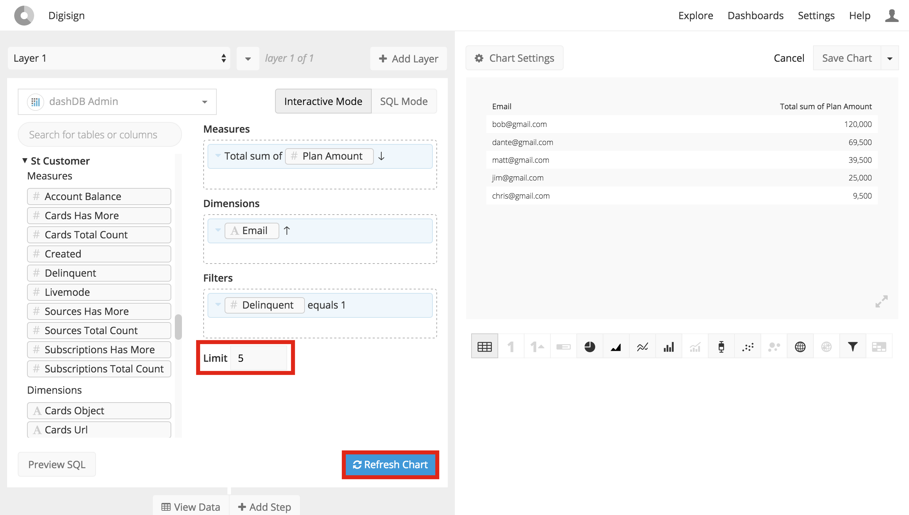

### Use the Data Pipeline to divide the `Plan Amount` in cents by 100 to get dollars

### Change the visualization from table to bar chart
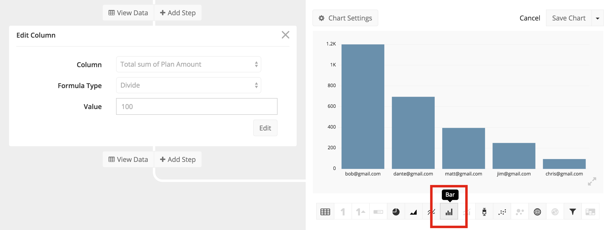

### Navigate to the Chart Settings, title the chart and y-axis and click "Done"
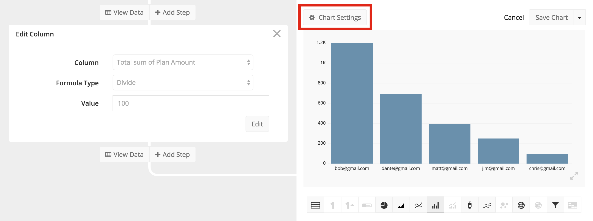
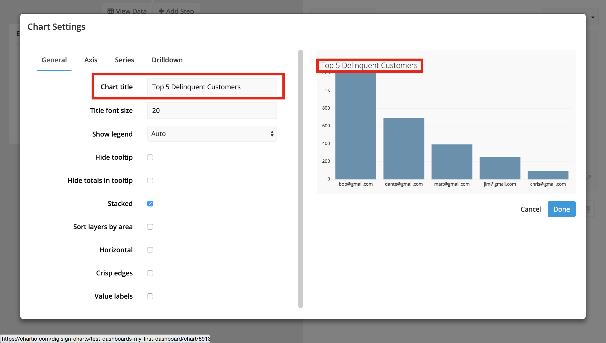
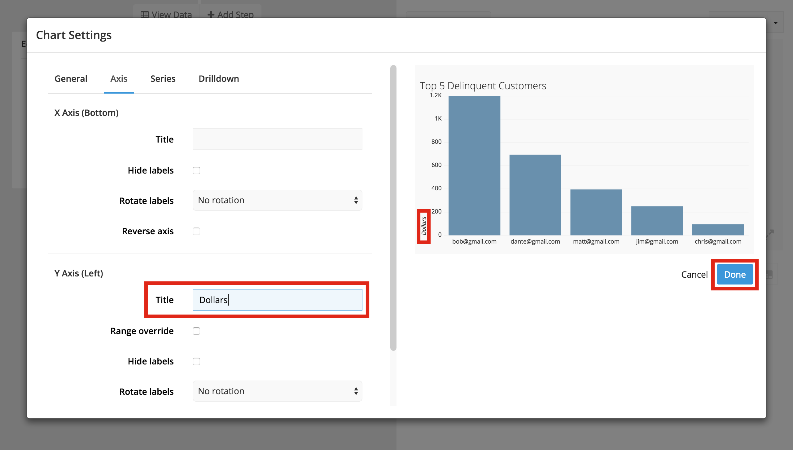

### Save the chart to the dashboard
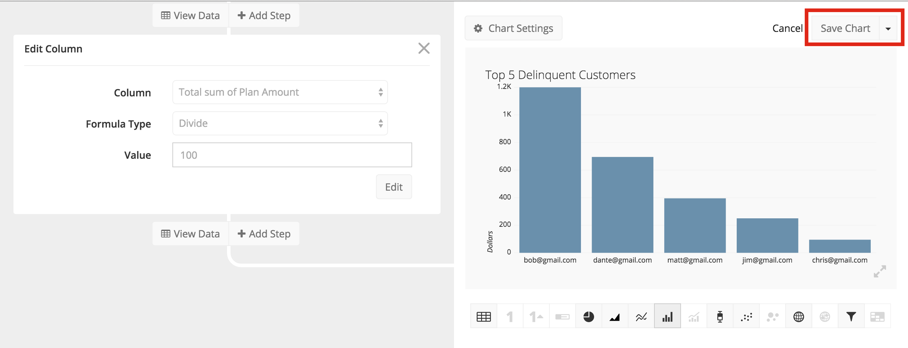
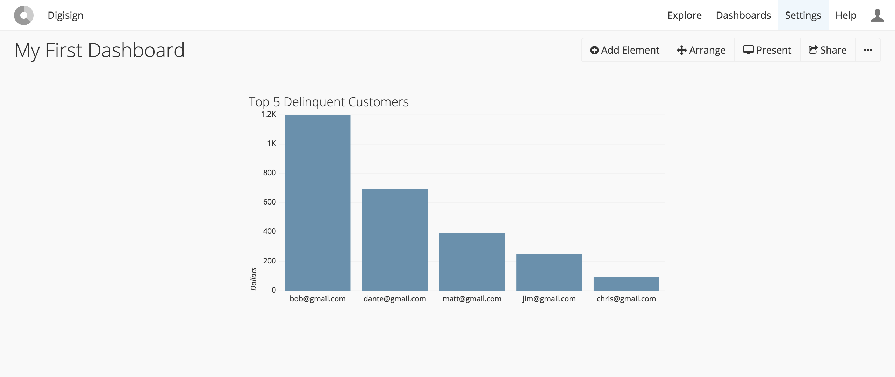
