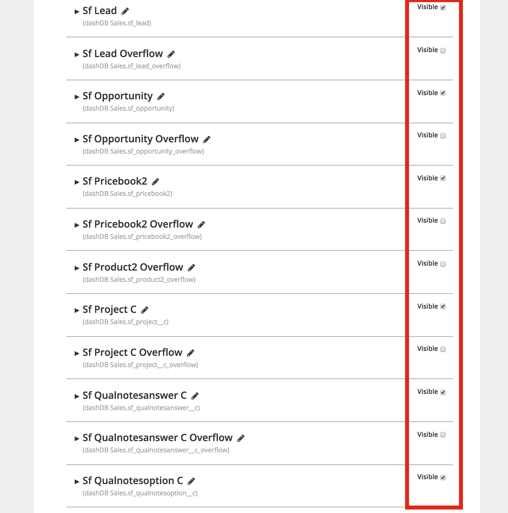

# Custom Schemas

## Overview
This tutorial will walk you through creating team-specific custom schemas within Chartio. In the
[Getting Connected tutorial](../getting-connected/README.md), we created a connection to dashDB and
imported *all* of the available tables from both Salesforce and Stripe. This is great for admin or
power users but can be dificult to navigate for departmental teams who only need access to a portion
of the tables to do their job. To address this issue we will create two team-specific schemas:

- **dashDB Finance:** This will limit access to just the Stripe data. For convenience, it will also
                      include a custom column that converts an amount stored in Stripe as cents to
                      dollars.
- **dashDB Sales:** This will limit access to just the Salesforce data. For convenience, it will
                    also include a custom table that limits access further to just

Before starting this tutorial, make sure you have completed the
[Creating a Chart tutorial](../creating-a-chart/README.md) in order to fully understand the value of
creating custom schemas. Also, [contact support](../support/README.md) to get two additional clones
of the dashDB Admin data source we set up in the
[Getting Connected tutorial](../getting-connected/README.md). In lieu of contacting support, you
could also go through the steps in the [Getting Connected tutorial](../getting-connected/README.md)
two additional times. The end result should be two new data sources as follows:

## Tutorial

### Steps
- [Hide all tables in the dashDB Finance data source](#hide-all-tables-in-the-dashdb-finance-data-source)
- [Toggle visibility on for the `St` prefixed tables (except for overflow system tables)](#toggle-visibility-on-for-the-st-prefixed-tables-except-for-overflow-system-tables)
- [Create a `Plan Amount ($)` custom column on the `St Customer Subscription Data` table](#create-a-plan-amount--custom-column-on-the-st-customer-subscription-data-table)
- [Set the Query Mode to "Interactive Mode Only" on the General tab](#set-the-query-mode-to-interactive-mode-only-on-the-general-tab)
- [Click "Explore" and create a chart with the new `Plan Amount ($)` custom column](#click-explore-and-create-a-chart-with-the-new-plan-amount--custom-column)
- [Hide all tables in the dashDB Sales data source](#hide-all-tables-in-the-dashdb-sales-data-source)
- [Toggle visibility on for the `Sf` prefixed tables (except for overflow system tables)](#toggle-visibility-on-for-the-sf-prefixed-tables-except-for-overflow-system-tables)
- [Create a `Open Opportunities` custom table](#create-a-open-opportunities-custom-table)
- [Set the Query Mode to "Interactive Mode Only" on the General tab](#set-the-query-mode-to-interactive-mode-only-on-the-general-tab-1)
- [Click "Explore" and create a chart with the new `Open Opportunities` custom table](#click-explore-and-create-a-chart-with-the-new-open-opportunities-custom-table)

### Hide all tables in the dashDB Finance data source

### Toggle visibility on for the `St` prefixed tables (except for overflow system tables)

### Create a `Plan Amount ($)` custom column on the `St Customer Subscription Data` table

### Set the Query Mode to "Interactive Mode Only" on the General tab

### Click "Explore" and create a chart with the new `Plan Amount ($)` custom column

### Hide all tables in the dashDB Sales data source

### Toggle visibility on for the `Sf` prefixed tables (except for overflow system tables)

### Create a `Open Opportunities` custom table

### Set the Query Mode to "Interactive Mode Only" on the General tab

### Click "Explore" and create a chart with the new `Open Opportunities` custom table

