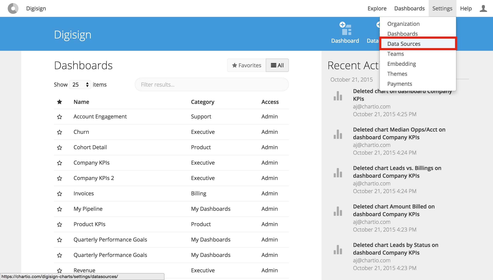
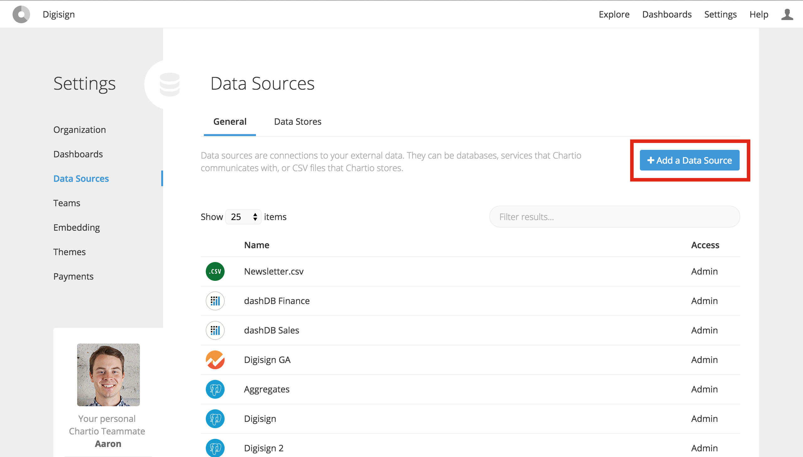
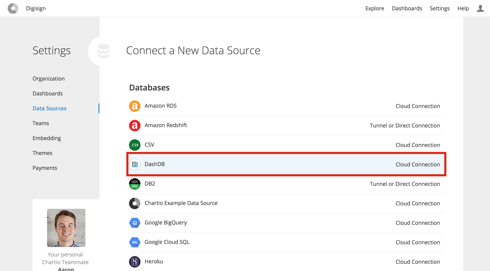
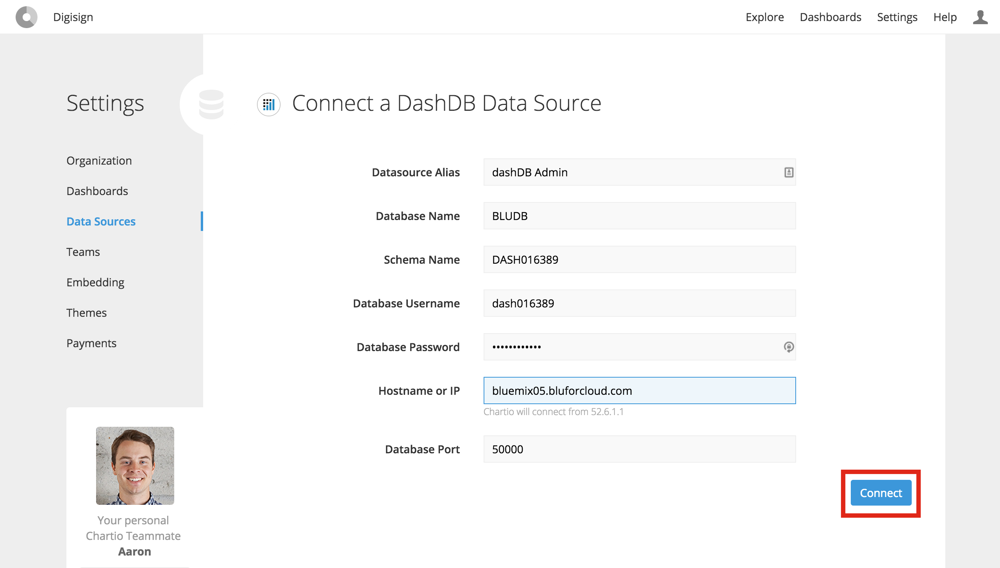
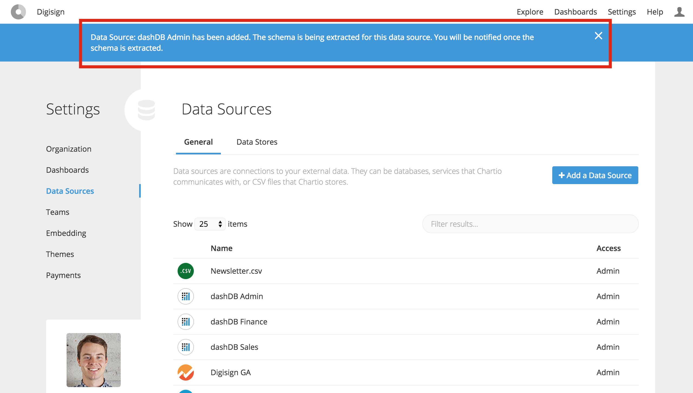
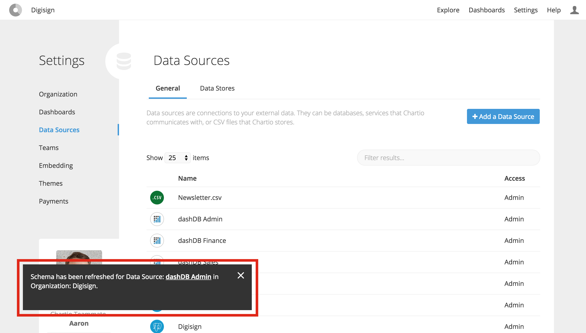
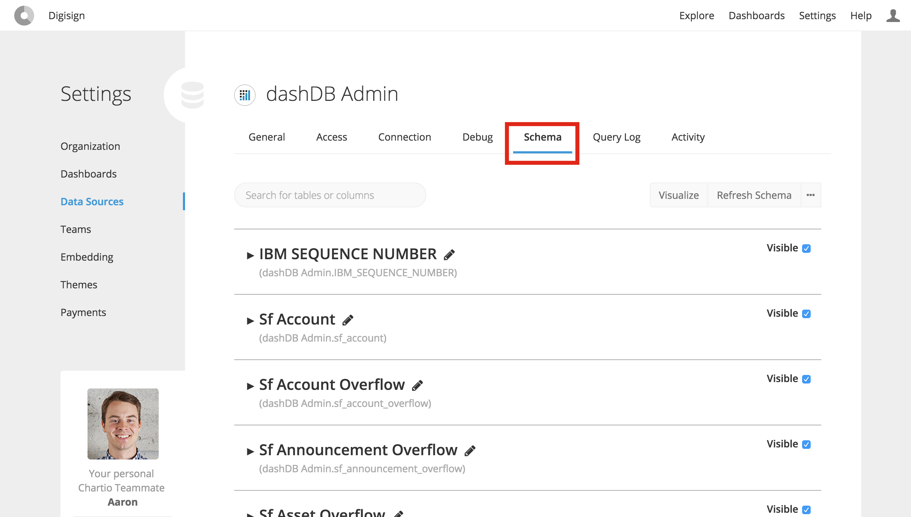

# Getting Connected

## Overview
This tutorial will walk you through the steps necessary to connect Chartio to dashDB and import
metadata about all of the available tables. Before starting this tutorial, make sure you have
completed all of the requirements listed [here](../README.md#requirements). Don't hesitate to
[contact support](../support/README.md) if you run into any issues!

## Tutorial

### Steps
- [Navigate to the data source settings page](#navigate-to-the-data-source-settings-page)
- [Click "Add a Data Source"](#click-add-a-data-source)
- [Select dashDB as the data source type](#select-dashdb-as-the-data-source-type)
- [Enter your connection details, click "Connect" and wait for the success notification](#enter-your-connection-details-click-connect-and-wait-for-the-success-notification)
- [Check the Schema tab and make sure all tables have been imported](#check-the-schema-tab-and-make-sure-all-tables-have-been-imported)

### Navigate to the data source settings page

### Click "Add a Data Source"

### Select dashDB as the data source type

### Enter your connection details, click "Connect" and wait for the success notification

### Check the Schema tab and make sure all tables have been imported

