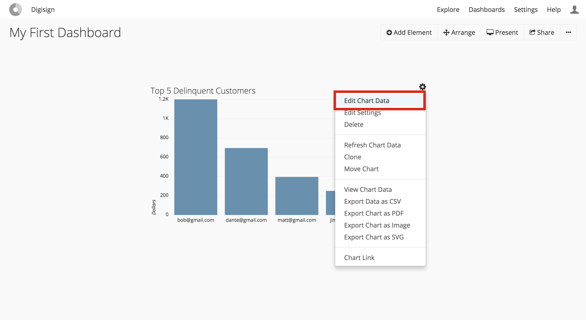

# Joining and Merging Data

## Overview
This tutorial will walk you through joining the delinquency data from our Stripe analysis in the
[Creating a Chart tutorial](../creating-a-chart/README.md) with account data from Salesforce. This
will allow us to retrieve the phone number for the delinquent account and follow up with them. We
will demonstrate two different ways to join data in Chartio:

- **In-database joins:** Chartio's drag and drop interface can generate efficient in-database joins
                         transparent to the end user. This allows non-technical users to merge data
                         residing within the same database without ever having to write a join. The
                         only requirement is that an admin has set up foreign keys in the Schema tab
                         for the database being queried. We will demonstrate creating a foreign key
                         from an email address in Stripe to an email address in Salesforce.
- **Cross-database joins:** Chartio's Layers functionality can perform cross-database joins. This is
                            ideal for joining data sets that reside on disparate database servers.
                            Layers can also join data within separate schemas on the same database
                            server. We will demonstrate the latter scenario using the dashDB Finance
                            and dashDB Sales data sources we created in the
                            [Custom Schemas tutorial](../custom-schemas/README.md).

Before starting this tutorial, make sure you have completed the
[Custom Schemas tutorial](../custom-schemas/README.md). Don't hesitate to
[contact support](../support/README.md) if you run into any issues!

## Tutorial

### Steps
- [Setup a foreign key from `St Customer.Email` to `Sf Contact.Email` in dashDB Admin](#setup-a-foreign-key-from-st-customeremail-to-sf-contactemail-in-dashdb-admin)
- [Edit the chart from the Creating a Chart tutorial and add `Sf Contact.Phone`](#edit-the-chart-from-the-creating-a-chart-tutorial-and-add-sf-contactphone)

### Setup a foreign key from `St Customer.Email` to `Sf Contact.Email` in dashDB Admin

### Edit the chart from the Creating a Chart tutorial and add `Sf Contact.Phone`

